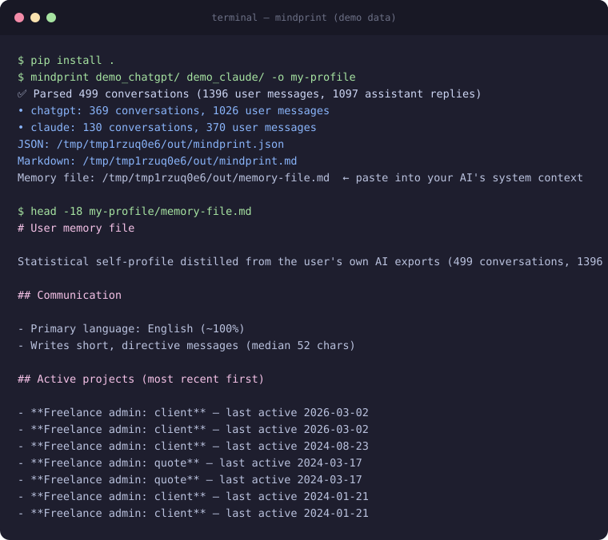

# 🧠 mindprint

[](https://github.com/Med34000/mindprint/actions/workflows/ci.yml) [](LICENSE) [](pyproject.toml)

**Turn your AI chat exports into a structured self-profile — 100% locally.**

Your ChatGPT and Claude histories contain months of your projects, decisions, writing style and priorities — scattered across corporate silos. **mindprint** merges them into one profile file you own. And unlike cloud alternatives, **not a single byte leaves your machine**.

<p align="center">
  
</p>

> 🔍 **See a full real-format example:** [`example/mindprint.example.md`](example/mindprint.example.md) — generated from a synthetic corpus (fictional user), same pipeline, same output.

> Proton's [AI Paper Trail](https://proton.me/lumo/ai/ai-paper-trail) proved the demand: people want to see what their AI knows about them. But it uploads your export to their servers, covers one export at a time, and outputs a one-shot report. mindprint is the open-source, fully offline counterpart — and its output is a **reusable profile you own**.

## ✨ What you get

- **Topics** — the words and phrases you actually use, ranked
- **🚀 Project signals** — conversations carrying project evidence (MVP, pricing, deadline, client…), with Claude project names when available
- **Activity timeline** — conversations per month, busiest hours
- **✍️ Writing style** — message length, question ratio, tu/vous usage
- **🌍 Language mix** — EN/FR heuristic
- **🧠 Memory file** (`memory-file.md`) — the headline output: a compact, dated, AI-ready context block to paste into a system prompt, `CLAUDE.md`, `AGENTS.md`, or any assistant's custom instructions. Your AI starts every conversation already knowing your language, style, projects and rhythm — computed from your real history, not self-declared guesses
- **JSON + Markdown** outputs: machine-readable profile + human-readable report
- **Multi-source** — ChatGPT and Claude in one merged profile, duplicates across overlapping exports deduplicated automatically

## 🔒 Privacy model

| | mindprint | Cloud tools |
|---|---|---|
| Upload of your export | ❌ never | ✅ |
| Account required | ❌ | ✅ |
| Network access at runtime | ❌ none — [enforced by test](tests/test_no_network.py) | required |
| Runtime dependencies | 0 | — |
| Code auditable | ✅ MIT, this repo | ❌ |

The privacy claim is not a promise, it's a **test**: the CI runs the full pipeline with socket creation blocked — any future dependency that tries to phone home fails the build.

## 📦 Install

```bash
pip install .          # from a clone of this repo
# or
uv pip install -e ".[dev]"   # development setup
```

Requires Python ≥ 3.10. **Zero runtime dependencies.**

## 🚀 Usage

1. **Export your data** from your provider (official export):
   - **ChatGPT**: Settings → Data controls → Export data → download the ZIP from the email link
   - **Claude**: Settings → Privacy → Export data → the new flow delivers a manifest JSON with download links — save everything into one folder (conversations, projects, users files, whether as ZIPs or extracted)
2. **Run mindprint** — one or several exports, any mix:

```bash
mindprint ~/Downloads/chatgpt-export.zip ~/Downloads/claude_export/ -o my-profile
# ✅ Parsed 496 conversations (2536 user messages, 2861 assistant replies)
#   • chatgpt: 394 conversations, 1735 user messages
#   • claude: 102 conversations, 801 user messages
#   JSON: my-profile/mindprint.json
#   Markdown: my-profile/mindprint.md
```

Extracted the ZIP already? Point mindprint at the directory instead — both work. Output files are written with owner-only permissions (0600).

## 🗂 Supported formats

| Provider | Status | Notes |
|---|---|---|
| ChatGPT (ZIP) | ✅ | Handles the `mapping` tree (active thread), legacy flat layouts, and the new **sharded** `conversations-000.json…` format |
| Claude (ZIP or manifest export) | ✅ | Flat `chat_messages`, content blocks tolerated (thinking/tool_use skipped), `projects.json` **and** per-file `projects/<uuid>.json` layouts |
| Gemini | 🧭 planned | via Google Takeout |
| Grok | 🧭 planned | via X archive |

Providers changed their export formats **twice while this tool was being built** (sharded ChatGPT, manifest Claude) — both were caught by real-user tests and are now handled. This maintenance burden is exactly why this tool exists.

## ⚡ Performance

Real-world benchmark (2026-09): a 282 MB ChatGPT export — 394 conversations, 3 677 messages — parses in **0.4 s** with ~80 MB RAM.

## 🧪 Development

```bash
uv pip install -e ".[dev]"
python -m pytest tests/          # 30 tests, synthetic fixtures only
python scripts/make_demo_profile.py   # regenerate example/ + docs/terminal.svg
```

The test-suite generates synthetic export fixtures mimicking the real official formats (`tests/make_fixtures.py`) — **no real personal data is ever committed**. The public example is generated from a synthetic corpus too.

## 🗺 Roadmap

- [x] v0.1 — ChatGPT + Claude ingestion, statistical profile
- [x] v0.2 — multi-export merge (ChatGPT + Claude in one profile, dedup across overlapping exports)
- [x] v0.3 — **memory file**: compact AI-ready context output (`memory-file.md`)
- [ ] v0.4 — optional LLM enrichment (local Ollama, opt-in)
- [ ] v0.4 — Gemini (Takeout) + Grok (X archive)
- [ ] v0.5 — timeline diffing: "what changed in my focus this month?"
- [ ] Desktop app packaging

## ⚠️ Ethics

mindprint is for **your own data, on your own machine**. Analyzing another person's export without their consent is illegal profiling (GDPR art. 6 and equivalents) — don't, and we won't help.

## License

MIT
